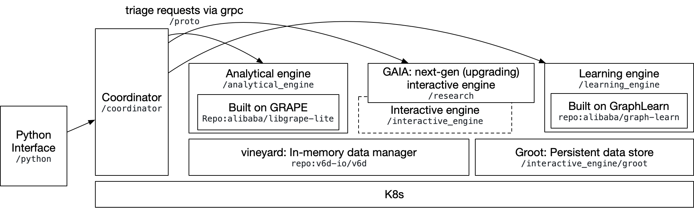

# 学习路径：
[#1513](https://github.com/alibaba/GraphScope/discussions/1513)

1. Python Interface, the python client for end-users;
2. coordinator: it manages the k8s cluster and receives all requests and triages them to the responding engine;
3. analytical_engine: for iterative graph algorithms, which extends GRAPE;
4. interactive_engine: for gremlin queries, please note that the fold is being deprecated and upgraded to GAIA;
5. learning_engine: for GNN, it was built on graph-learn;
6. vineyard: an in-memory data manager, graphs on all engines are managed by vineyard;
7. groot: a persistent store for graph.
Since the codebase is still in change, I would suggest the learning path can be:
1) -> 2) -> 3) -> 6) -> 4) -> 5) -> 7)

代码阅读笔记：
1. 1）Python Client 通过 RPC 拉起服务
    * 发送各种指令：
        * 创建Session【两种部署方式：本机，K8S 】
        * 创建图
        * 加载点边:具体读文件，加载到内存是在后端进行的
        * 创建查询Interactive:支持Gremlin & Cypher 语言 
2. 2）Coordinator 独立一个模块：
    * 启动Server ：通过python 启动服务
    * 脚本调度，构建工作流
    * 需要明确 RPC 骨架对应的服务
3. 3）Analytical_engine 模块：
    * 跑各种算法：语言栈 C++
4. 6）Vineyard: 
    * 基于内存存储图数据，基于之上进行图计算
    * 通过python 启动进程
5. 4）Interactive_engine: 交互式查询引擎
    * 主要是满足接收Gremlin + Cypher ，然后转换成查询计划，分布式执行 Gremlin ？
    * 此处主要看计算引擎 + 存储引擎的核心技术实现

TODO : 
增加每个模块的源码介绍