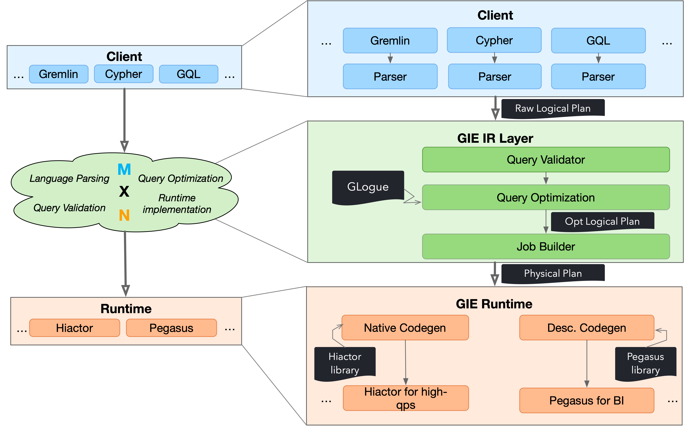

# 阅读官方文档笔记
[GIE Doc](https://graphscope.io/docs/interactive_engine/getting_started)。  
[LDBC 教程](https://graphscope.io/docs/interactive_engine/tinkerpop/tutorial_ldbc_gremlin)  

## 1. 使用场景

## 2. 技术架构

## 3.本机开发测试环境
docker run --name dev -it --shm-size=4096m registry.cn-hongkong.aliyuncs.com/graphscope/graphscope-dev:latest  
目标： 如何在本机快速搭建集成测试环境  
1. mac 
2. docker
3. VSCODE